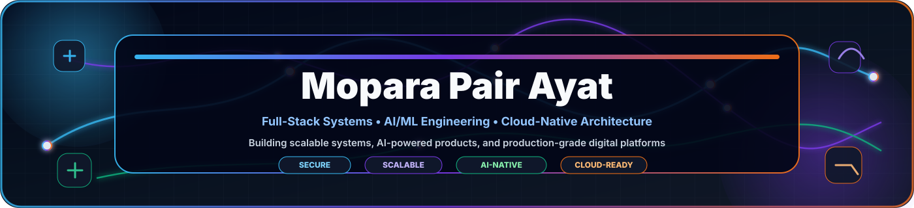
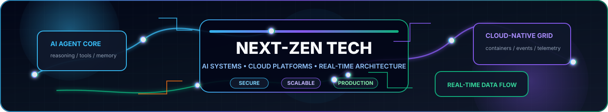

<p align="center">
  
</p>

<table width="100%">
<tr>
<td align="center" valign="middle">
  
  <br><br>
  <h2>السَّلاَمُ عَلَيْكُمْ وَرَحْمَةُ اللهِ وَبَرَكَاتُهُ</h2>
  <b>Assalamu'alaikum warahmatullahi wabarakatuh</b>
  <br>
  <i>May the peace, mercy, and blessings of Allah be with you.</i>
</td>
</tr>
</table>

<p align="center">
  
</p>

<p align="center">
  
  <br>
  <a href="mailto:moparapairayat@gmail.com"></a>
  <a href="https://github.com/Moparapairayat"></a>
  <a href="https://moparapairayat.com"></a>
  
</p>

<p align="center">
  <a href="#mission-control"></a>
  <a href="#professional-expertise"></a>
  <a href="#next-zen-technology-universe"></a>
  <a href="#project-launchpad"></a>
  <a href="#contact--connect"></a>
</p>

<table width="100%">
<tr>
<td align="center" valign="middle">
  
  <br><br>
  <b>Full-Stack Developer • AI/ML Engineer • Systems Thinker</b>
  <br>
  Building useful, scalable, secure digital products from concept to production.
</td>
</tr>
</table>

---

<a id="mission-control"></a>

## 🛰️ Mission Control

<p align="center">
  
</p>

<p align="center">
  
  <br>
  
  <br>
  
  <br>
  
</p>

<p align="center">
  
  <br>
  <b>Software Engineer | Full-Stack | Data Science</b>
</p>

<p align="center">
  
  <br>
  
  
  
  
</p>

### 🔥 Why Work With Me?

| ✅ Production Excellence | ⚡ Performance Focused | 🔒 Security Minded | 🤝 Collaborative |
|--------------------------|------------------------|--------------------|------------------|
| Clean, maintainable, battle-tested code | Speed, scale, cost, and reliability | Secure-by-default thinking | Clear execution and communication |

---

## 🧩 Operating System

| Layer | How I Work |
|-------|------------|
| Discover | Clarify the problem, users, constraints, risks, and success criteria |
| Design | Model the system, data flow, user flow, and deployment surface |
| Build | Implement with clean boundaries, pragmatic abstractions, and testable logic |
| Harden | Improve reliability, security, observability, and performance |
| Ship | Deliver docs, deployment readiness, and iteration paths |

| Engineering Principle | Practical Meaning |
|----------------------|-------------------|
| Product-first | Code exists to solve a real problem |
| Architecture-aware | Systems should scale without becoming fragile |
| Security-aware | Sensitive flows deserve careful defaults |
| Performance-aware | Speed, cost, and reliability are part of UX |
| Documentation-aware | Good systems should be understandable later |

---

<a id="professional-expertise"></a>

## 💎 Professional Expertise

### 🎯 Software Engineer | Full Stack Developer | Data Scientist

| Domain | Focus | Output |
|--------|-------|--------|
| 💻 Full-Stack Engineering | Frontend • Backend • APIs • Databases | Complete product workflows |
| 🤖 AI/ML Engineering | LLMs • RAG • Agents • Analytics • ML pipelines | Intelligent automation and data products |
| 🏗️ System Architecture | Microservices • Events • Real-time • Cloud | Scalable, production-ready systems |
| 🔒 Security & Reliability | Auth • Monitoring • Validation • Hardening | Safer software with fewer surprises |

### 💎 Core Competencies Matrix

| 📂 Category | 🎯 Core Skills | Depth |
|------------|----------------|-------|
| 🏗️ Architecture | Microservices • Distributed Systems • Event-Driven • CQRS • Real-time | ⭐⭐⭐⭐⭐ |
| ⚛️ Frontend | React • Next.js • TypeScript • Tailwind CSS • D3.js • Web3 • Performance | ⭐⭐⭐⭐⭐ |
| 🔧 Backend | Node.js • Python • Go • FastAPI • GraphQL • REST • tRPC • WebSockets | ⭐⭐⭐⭐⭐ |
| 🗄️ Data | PostgreSQL • MongoDB • Redis • Kafka • DynamoDB • Elasticsearch • Vector DB | ⭐⭐⭐⭐⭐ |
| 🤖 AI/ML | PyTorch • TensorFlow • LLMs • RAG Systems • Pandas • NumPy • scikit-learn | ⭐⭐⭐⭐⭐ |
| ☁️ Platform | Docker • Kubernetes • AWS • GCP • GitHub Actions • Prometheus • ELK Stack | ⭐⭐⭐⭐ |

### 🧠 Intelligence Stack

| AI Layer | Capabilities |
|----------|--------------|
| LLM Apps | Chat, copilots, assistants, structured outputs, tool calling |
| Agentic Workflows | Multi-step automation, retrieval, planning, task orchestration |
| RAG Systems | Embeddings, vector search, reranking, knowledge-grounded answers |
| Data Science | EDA, feature engineering, modeling, evaluation, reporting |
| MLOps / LLMOps | Experiment tracking, deployment, monitoring, safety checks |

---

## 🚀 Build Lanes

| Lane | What I Build | Typical Stack |
|------|--------------|---------------|
| SaaS Platforms | Dashboards, auth, billing-ready flows, admin systems | Next.js • Node.js • PostgreSQL • Redis |
| AI Products | Agents, RAG apps, LLM pipelines, automation tools | Python • OpenAI/Claude/Gemini • Vector DB |
| Real-time Systems | Live dashboards, sockets, event streams, notifications | WebSockets • Kafka • Redis • Node.js |
| Data Platforms | Analytics, ETL, reporting, ML experiments | Python • Pandas • Polars • PostgreSQL |
| Cloud Infrastructure | Deployments, CI/CD, observability, containerization | Docker • Kubernetes • GitHub Actions • AWS/GCP |

---

<a id="next-zen-technology-universe"></a>

## 🧬 Next-Zen Technology Universe

### ⚡ Core Engineering

<p align="center">
  
</p>

### 🌌 Frontend • Web Experience

<p align="center">
  
  <br><br>
  
  
  
  
  
</p>

### 🧠 AI • AGI • Autonomous Systems

<p align="center">
  
  <br><br>
  
  
  
  
  
  
  
  
  
  
  
  
  
  
  
</p>

### ☁️ Cloud Native • Platform Engineering

<p align="center">
  
  <br><br>
  
  
  
  
  
  
  
  
  
  
</p>

### 🗄️ Distributed Data Systems

<p align="center">
  
  <br><br>
  
  
  
  
  
  
  
  
</p>

### 🔐 Cybersecurity • Zero Trust

<p align="center">
  
  <br><br>
  
  
  
  
  
  
  
  
</p>

### 🌐 Web3 • Robotics • XR • Creative Engineering

| Web3 | Robotics / IoT | Graphics / XR | Creative |
|------|----------------|---------------|----------|
|  |  |  |  |
| Smart Contracts • Layer2 • DAO | Embedded • Edge AI • Automation | WebXR • Simulation • Spatial Computing | Design Systems • UI Motion • Generative Design |

### 🧰 Elite Developer Arsenal

<p align="center">
  
  <br><br>
  
  
  
  
  
  
</p>

<details>
<summary><b>🧪 Future Tech Research Radar</b></summary>

<br>

<p align="center">
  
  
  
  
  
  
</p>

</details>

---

## 🧪 System Design Playbook

| Design Area | Preferred Direction |
|-------------|---------------------|
| API Design | Clear contracts, typed payloads, versioning when needed |
| Data Modeling | Start simple, index intentionally, design for query patterns |
| Reliability | Idempotent jobs, retries, timeouts, observability hooks |
| Security | Least privilege, validation, secret isolation, audit-friendly flows |
| Performance | Cache only where it helps, measure before over-optimizing |
| DX | Scripts, documentation, local setup, and maintainable conventions |

---

## 🛠️ Delivery Blueprint

```text
Idea → Requirements → Architecture → Prototype → Production Build
     → Testing → Hardening → Documentation → Launch → Iteration
```

| Phase | Output |
|-------|--------|
| Discovery | Feature map, risk map, user flows |
| Implementation | Clean code, reusable modules, API boundaries |
| Verification | Tests, manual QA notes, edge-case checks |
| Release | Deployment readiness, rollback thinking, docs |

---

<a id="project-launchpad"></a>

## 🚀 Project Launchpad

<p align="center">
  
  
</p>

| Project Quality Signal | Meaning |
|------------------------|---------|
| ✅ Production-quality code | Designed to survive real usage |
| 🔒 Security practices | Auth, validation, privacy, and safe defaults |
| 📈 Scalable architecture | Clear boundaries and growth paths |
| 📚 Documentation | Systems that can be understood and improved |
| 🚀 Performance optimization | Fast enough, measurable, and cost-aware |

---

## 📊 GitHub Analytics & Insights

<p align="center">
  
  
  <br><br>
  
</p>

<p align="center">
  
</p>

<p align="center">
  
</p>

<p align="center">
  
</p>

---

## 📡 Global Signal

<p align="center">
  <a href="mailto:Support@moparapairayat.com"></a>
  <a href="https://moparapairayat.com"></a>
  <a href="https://moparapairayat.uk"> </a>
  <a href="https://moparapairayat.bd"> </a>
  <a href="https://moparapairayat.sa"> </a>
  <a href="https://moparapairayat.tr"> </a>
  <a href="https://moparapairayat.ir"> </a>
  <a href="https://moparapairayat.us"> </a>
  <a href="https://moparapairayat.ca"> </a>
  <a href="https://moparapairayat.de"> </a>
</p>

### 📍 Regional Contact Matrix

<p align="center">
  
  
  
</p>

<table>
<tr>
<td width="33%" align="center" valign="top">
  
  <br><br>
  <b>🌍 Global HQ</b>
  <br>
  <a href="https://moparapairayat.com"><b>moparapairayat.com</b></a>
  <br>
  <a href="mailto:Support@moparapairayat.com">Support@moparapairayat.com</a>
  <br><br>
  <sub>International clients and global services</sub>
</td>
<td width="33%" align="center" valign="top">
  
  <br><br>
  
  <b>Turkey</b>
  <br>
  <a href="https://moparapairayat.tr"><b>moparapairayat.tr</b></a>
  <br>
  <a href="mailto:Support@moparapairayat.tr">Support@moparapairayat.tr</a>
  <br><br>
  <sub>Turkish and EU services</sub>
</td>
<td width="33%" align="center" valign="top">
  
  <br><br>
  
  <b>Bangladesh</b>
  <br>
  <a href="https://moparapairayat.bd"><b>moparapairayat.bd</b></a>
  <br>
  <a href="mailto:Support@moparapairayat.bd">Support@moparapairayat.bd</a>
  <br><br>
  <sub>Regional operations hub</sub>
</td>
</tr>
<tr>
<td width="33%" align="center" valign="top">
  
  <br><br>
  
  <b>Saudi Arabia</b>
  <br>
  <a href="https://moparapairayat.sa"><b>moparapairayat.sa</b></a>
  <br>
  <a href="mailto:Support@moparapairayat.sa">Support@moparapairayat.sa</a>
  <br><br>
  <sub>Middle East operations</sub>
</td>
<td width="33%" align="center" valign="top">
  
  <br><br>
  
  <b>United Kingdom</b>
  <br>
  <a href="https://moparapairayat.uk"><b>moparapairayat.uk</b></a>
  <br>
  <a href="mailto:Support@moparapairayat.uk">Support@moparapairayat.uk</a>
  <br><br>
  <sub>UK-based services and support</sub>
</td>
<td width="33%" align="center" valign="top">
  
  <br><br>
  
  <b>Iran</b>
  <br>
  <a href="https://moparapairayat.ir"><b>moparapairayat.ir</b></a>
  <br>
  <a href="mailto:Support@moparapairayat.ir">Support@moparapairayat.ir</a>
  <br><br>
  <sub>Iran-based services and support</sub>
</td>
</tr>
<tr>
<td width="33%" align="center" valign="top">
  
  <br><br>
  
  <b>USA</b>
  <br>
  <a href="https://moparapairayat.us"><b>moparapairayat.us</b></a>
  <br>
  <a href="mailto:Support@moparapairayat.us">Support@moparapairayat.us</a>
  <br><br>
  <sub>USA-based services and support</sub>
</td>
<td width="33%" align="center" valign="top">
  
  <br><br>
  
  <b>Canada</b>
  <br>
  <a href="https://moparapairayat.ca"><b>moparapairayat.ca</b></a>
  <br>
  <a href="mailto:Support@moparapairayat.ca">Support@moparapairayat.ca</a>
  <br><br>
  <sub>Canada-based services and support</sub>
</td>
<td width="33%" align="center" valign="top">
  
  <br><br>
  
  <b>Germany</b>
  <br>
  <a href="https://moparapairayat.de"><b>moparapairayat.de</b></a>
  <br>
  <a href="mailto:Support@moparapairayat.de">Support@moparapairayat.de</a>
  <br><br>
  <sub>Germany-based services and support</sub>
</td>
</tr>
</table>

---

<a id="contact--connect"></a>

## 📧 Contact & Connect

<p align="center">
  
  
  
</p>

<p align="center">
  <b>Ready to collaborate? Choose your preferred channel below.</b>
</p>

### 💼 Communication Channels

<table>
<tr>
<td width="33%" align="center" valign="top">
  
  <br><br>
  <b>General inquiries and contracts</b>
  <br><br>
  <a href="mailto:Support@moparapairayat.com">Send Email</a>
</td>
<td width="33%" align="center" valign="top">
  
  <br><br>
  <b>View full work and services</b>
  <br><br>
  <a href="https://moparapairayat.com">Visit Site</a>
</td>
<td width="33%" align="center" valign="top">
  
  <br><br>
  <b>Projects and open source</b>
  <br><br>
  <a href="https://github.com/Moparapairayat">Follow</a>
</td>
</tr>
</table>

### 💌 Business Email Contacts

<table>
<tr>
<td width="50%" align="center" valign="top">
  
  <br><br>
  <a href="mailto:Moparapairayat@gmail.com"><b>📧 Moparapairayat@gmail.com</b></a>
</td>
<td width="50%" align="center" valign="top">
  
  <br><br>
  <a href="mailto:Moparapairayatbd@gmail.com"><b>📧 Moparapairayatbd@gmail.com</b></a>
</td>
</tr>
</table>

### 📞 WhatsApp Business Lines

<p align="center">
  
  
</p>

<table>
<tr>
<td colspan="4" align="center" valign="top">
  <b>Direct Lines by Workstream</b>
  <br>
  <sub>Choose the lane that matches your project type for faster routing.</sub>
</td>
</tr>
<tr>
<th align="center">Lane</th>
<th align="center">Number</th>
<th align="center">Best For</th>
<th align="center">Action</th>
</tr>
<tr>
<td align="center" valign="middle">
  
</td>
<td align="center" valign="middle">
  <a href="https://wa.me/17243155810"><b>📱 724-315-5810</b></a>
</td>
<td align="center" valign="middle">
  <sub>Startup and personal projects</sub>
</td>
<td align="center" valign="middle">
  <a href="https://wa.me/17243155810">
    
  </a>
</td>
</tr>
<tr>
<td align="center" valign="middle">
  
</td>
<td align="center" valign="middle">
  <a href="https://wa.me/17196802913"><b>📱 719-680-2913</b></a>
</td>
<td align="center" valign="middle">
  <sub>Enterprise and corporate work</sub>
</td>
<td align="center" valign="middle">
  <a href="https://wa.me/17196802913">
    
  </a>
</td>
</tr>
<tr>
<td align="center" valign="middle">
  
</td>
<td align="center" valign="middle">
  <a href="https://wa.me/8801955000704"><b>📱 801955000704</b></a>
</td>
<td align="center" valign="middle">
  <sub>Data science and ML</sub>
</td>
<td align="center" valign="middle">
  <a href="https://wa.me/8801955000704">
    
  </a>
</td>
</tr>
<tr>
<td align="center" valign="middle">
  
</td>
<td align="center" valign="middle">
  <a href="https://wa.me/8801305868621"><b>📱 801305868621</b></a>
</td>
<td align="center" valign="middle">
  <sub>Security and cloud</sub>
</td>
<td align="center" valign="middle">
  <a href="https://wa.me/8801305868621">
    
  </a>
</td>
</tr>
</table>

### 🎯 Response Time Expectations

<p align="center">
  
  
  
</p>

### ✨ Let's Collaborate!

<table>
<tr>
<td align="center" valign="top">
  <b>💡 Project Ideas</b>
  <br>
  <sub>Product concepts</sub>
</td>
<td align="center" valign="top">
  <b>🏢 Enterprise Needs</b>
  <br>
  <sub>Large-scale systems</sub>
</td>
<td align="center" valign="top">
  <b>🚀 Startup Challenges</b>
  <br>
  <sub>Fast MVP execution</sub>
</td>
<td align="center" valign="top">
  <b>📚 Learning</b>
  <br>
  <sub>Mentorship and growth</sub>
</td>
<td align="center" valign="top">
  <b>🤝 Partnership</b>
  <br>
  <sub>Long-term collaboration</sub>
</td>
</tr>
</table>

---

## ☕ Support the Work

<p align="center">
  
  
  
</p>

<p align="center">
  If my work has been helpful to you, consider supporting my projects and future development.
</p>

<table>
<tr>
<td colspan="3" align="center" valign="top">
  <b>Support Channels</b>
  <br>
  <sub>Pick a lane, fuel the roadmap, and help future tools ship faster.</sub>
</td>
</tr>
<tr>
<th align="center">Channel</th>
<th align="center">Purpose</th>
<th align="center">Status / Action</th>
</tr>
<tr>
<td align="center" valign="middle">
  
</td>
<td align="center" valign="middle">
  <b>Support my work</b>
</td>
<td align="center" valign="middle">
  
</td>
</tr>
<tr>
<td align="center" valign="middle">
  
</td>
<td align="center" valign="middle">
  <b>Support innovation</b>
</td>
<td align="center" valign="middle">
  
</td>
</tr>
<tr>
<td align="center" valign="middle">
  <a href="https://github.com/sponsors/Moparapairayat">
    
  </a>
</td>
<td align="center" valign="middle">
  <b>Become a sponsor</b>
</td>
<td align="center" valign="middle">
  <a href="https://github.com/sponsors/Moparapairayat">
    
  </a>
</td>
</tr>
</table>

<p align="center">
  <b>Your support helps me:</b>
</p>

<table>
<tr>
<td align="center" valign="top">
  
  <br><br>
  <b>Continue building open-source projects</b>
</td>
<td align="center" valign="top">
  
  <br><br>
  <b>Create better tools and solutions</b>
</td>
<td align="center" valign="top">
  
  <br><br>
  <b>Share knowledge through tutorials</b>
</td>
<td align="center" valign="top">
  
  <br><br>
  <b>Make positive global impact</b>
</td>
</tr>
</table>

---

## 🌟 Philosophy & Core Values

```text
INNOVATION    → Building next-gen solutions
SECURITY      → Trust through protection
SCALABILITY   → Growing without limits
COLLABORATION → Stronger together
EXCELLENCE    → Never settle for less
```

> *"Code is poetry. Architecture is art. Innovation is impact."*
>
> **— Mopara Pair Ayat**

---

## 🎯 Quick Stats

| Metric | Count |
|--------|-------|
| 💻 Projects | 50+ |
| ⭐ GitHub Stars | 500+ |
| 🤝 Collaborations | 30+ |
| 🏆 Achievements | 20+ |
| 📚 Contributions | 2000+ |

---

## 🚀 Ready to Collaborate?

| Level | Perfect For | Get Started |
|-------|-------------|-------------|
| 🎓 Entry | Learning and growth | [Email](mailto:Support@moparapairayat.com) |
| 💼 Professional | Business needs | [GitHub](https://github.com/Moparapairayat) |
| 🚀 Enterprise | Large-scale projects | [Portfolio](https://moparapairayat.com) |

<p align="center">
  
</p>

<p align="center">
  
</p>

## 📬 Final Call to Action

```text
┌─────────────────────────────────────────┐
│  Star my repositories for support       │
│  Drop a message on any platform         │
│  Connect with me on GitHub              │
│  Email for project inquiries            │
│  Let's create something extraordinary   │
└─────────────────────────────────────────┘
```

<h3 align="center">🎖️ Made with ❤️ by Mopara Pair Ayat</h3>

<p align="center">
  <i>Crafting digital excellence, one commit at a time.</i>
  <br><br>
  <a href="#mopara-pair-ayat"></a>
</p>
