<a id="mopara-pair-ayat"></a>

<p align="center">
  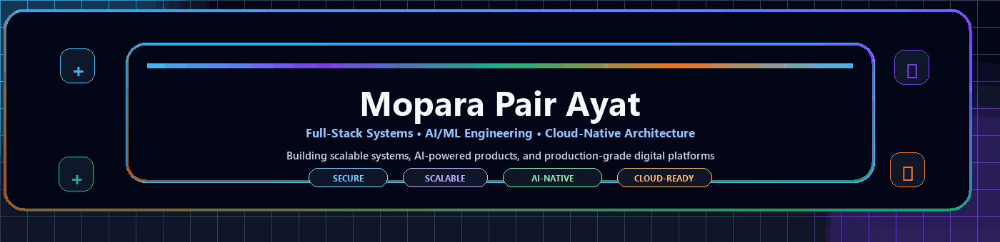
</p>

<p align="center">
  
  
  
</p>

<div align="center">

### السَّلاَمُ عَلَيْكُمْ وَرَحْمَةُ اللهِ وَبَرَكَاتُهُ

**Assalamu'alaikum warahmatullahi wabarakatuh**

**Full-Stack Developer • AI/ML Engineer • Systems Thinker**

</div>

<p align="center">
  
</p>

<p align="center">
  <a href="mailto:moparapairayat@gmail.com"></a>
  <a href="https://github.com/Moparapairayat"></a>
  <a href="https://moparapairayat.com"></a>
  
</p>

<p align="center">
  <a href="#mission-control"></a>
  <a href="#professional-expertise"></a>
  <a href="#next-zen-technology-universe"></a>
  <a href="#future--dangerous-command-center"></a>
  <a href="#project-launchpad"></a>
  <a href="#contact--connect"></a>
</p>

---

<a id="mission-control"></a>

<p align="center">
  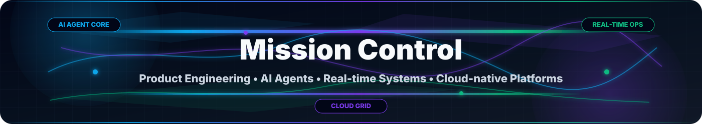
</p>

<p align="center">
  
  <br>
  
  <br>
  
  <br>
  
</p>

<p align="center">
  
  <br>
  <b>Software Engineer | Full-Stack | Data Science</b>
</p>

<p align="center">
  
  <br>
  
  
  
  
</p>

### 🔥 Why Work With Me?

<table align="center" width="100%">
<tr>
<th align="center" width="220">✅ Production Excellence</th>
<th align="center" width="220">⚡ Performance Focused</th>
<th align="center" width="220">🔒 Security Minded</th>
<th align="center" width="220">🤝 Future-ready Collaboration</th>
</tr>
<tr>
<td align="center">Clean, maintainable, battle-tested code</td>
<td align="center">Speed, scale, cost, and reliability</td>
<td align="center">Secure-by-default thinking</td>
<td align="center">Clear communication with AI-native, cloud-native delivery</td>
</tr>
</table>

---

<a id="operating-system"></a>

<p align="center">
  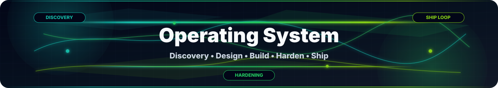
</p>

<p align="center">
  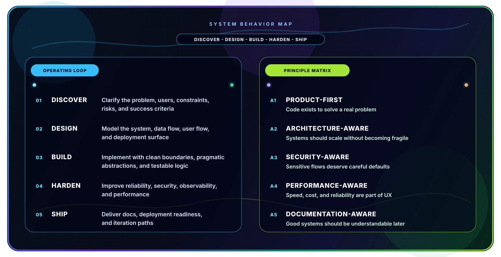
</p>

---

<a id="professional-expertise"></a>

<p align="center">
  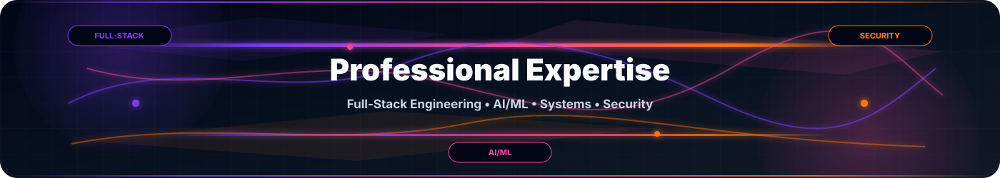
</p>

### 🎯 Software Engineer | Full Stack Developer | Data Scientist

<table align="center" width="100%">
<tr><th align="center" width="240">Domain</th><th align="center" width="340">Focus</th><th align="center" width="300">Output</th></tr>
<tr><td><b>💻 Full-Stack Engineering</b></td><td>Frontend • Backend • APIs • Databases • SaaS</td><td>Complete product workflows</td></tr>
<tr><td><b>🤖 AI/ML Engineering</b></td><td>LLMs • RAG • Agents • Multimodal AI • ML pipelines</td><td>Intelligent automation and data products</td></tr>
<tr><td><b>🏗️ System Architecture</b></td><td>Microservices • Events • Real-time • Cloud • Edge</td><td>Scalable, production-ready systems</td></tr>
<tr><td><b>🔒 Security & Reliability</b></td><td>Auth • DevSecOps • Observability • Validation • Hardening</td><td>Safer software with fewer surprises</td></tr>
<tr><td><b>⚡ Future Systems</b></td><td>LLMOps • Edge AI • WASM • Service Mesh • Cost-aware scale</td><td>Future-ready engineering foundations</td></tr>
</table>

### 💎 Core Competencies Matrix

<table align="center" width="100%">
<tr><th align="center" width="210">📂 Category</th><th align="center" width="560">🎯 Core Skills</th><th align="center" width="110">Depth</th></tr>
<tr><td><b>🏗️ Architecture</b></td><td>Microservices • Distributed Systems • Event-Driven • CQRS • Real-time • Multi-tenant SaaS • Edge</td><td align="center">⭐⭐⭐⭐⭐</td></tr>
<tr><td><b>⚛️ Frontend</b></td><td>React • Next.js • TypeScript • Tailwind CSS • D3.js • Web3 • WebGPU • Streaming UI</td><td align="center">⭐⭐⭐⭐⭐</td></tr>
<tr><td><b>🔧 Backend</b></td><td>Node.js • Python • Go • FastAPI • GraphQL • REST • tRPC • WebSockets • Queues</td><td align="center">⭐⭐⭐⭐⭐</td></tr>
<tr><td><b>🗄️ Data</b></td><td>PostgreSQL • MongoDB • Redis • Kafka • DynamoDB • Elasticsearch • Vector DB • Spark</td><td align="center">⭐⭐⭐⭐⭐</td></tr>
<tr><td><b>🤖 AI/ML</b></td><td>PyTorch • TensorFlow • LLMs • RAG • Agents • Multimodal AI • Evals • LLMOps</td><td align="center">⭐⭐⭐⭐⭐</td></tr>
<tr><td><b>☁️ Platform</b></td><td>Docker • Kubernetes • Terraform • AWS • GCP • GitHub Actions • OpenTelemetry • Service Mesh</td><td align="center">⭐⭐⭐⭐</td></tr>
<tr><td><b>🔐 Security</b></td><td>Zero Trust • OWASP • WAF • IAM • Supply-chain checks • Secrets hygiene • DevSecOps</td><td align="center">⭐⭐⭐⭐</td></tr>
</table>

### 🧠 Intelligence Stack

<table align="center" width="100%">
<tr><th align="center" width="240">AI Layer</th><th align="center" width="640">Capabilities</th></tr>
<tr><td><b>LLM Apps</b></td><td>Chat, copilots, assistants, structured outputs, tool calling, prompt systems</td></tr>
<tr><td><b>Agentic Workflows</b></td><td>Multi-step automation, retrieval, planning, memory, handoffs, task orchestration</td></tr>
<tr><td><b>RAG Systems</b></td><td>Embeddings, vector search, reranking, knowledge-grounded answers, citations, evals</td></tr>
<tr><td><b>Multimodal AI</b></td><td>Text, image, audio, video, document understanding, workflow automation</td></tr>
<tr><td><b>Edge AI</b></td><td>On-device inference, low-latency automation, lightweight model deployment</td></tr>
<tr><td><b>Data Science</b></td><td>EDA, feature engineering, modeling, evaluation, reporting</td></tr>
<tr><td><b>MLOps / LLMOps</b></td><td>Experiment tracking, deployment, monitoring, safety checks, feedback loops</td></tr>
</table>

---

<a id="build-lanes"></a>

<p align="center">
  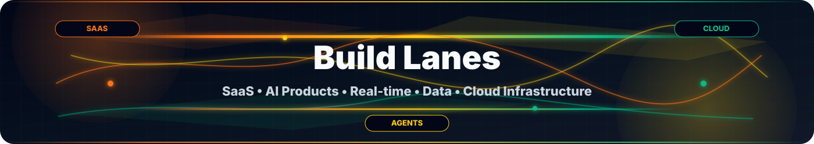
</p>

<table align="center" width="100%">
<tr><th align="center" width="220">Lane</th><th align="center" width="380">What I Build</th><th align="center" width="280">Typical Stack</th></tr>
<tr><td><b>SaaS Platforms</b></td><td>Dashboards, auth, billing-ready flows, admin systems</td><td>Next.js • Node.js • PostgreSQL • Redis</td></tr>
<tr><td><b>AI Products</b></td><td>Agents, RAG apps, LLM pipelines, automation tools</td><td>Python • OpenAI/Claude/Gemini • Vector DB</td></tr>
<tr><td><b>Real-time Systems</b></td><td>Live dashboards, sockets, event streams, notifications</td><td>WebSockets • Kafka • Redis • Node.js</td></tr>
<tr><td><b>Data Platforms</b></td><td>Analytics, ETL, reporting, ML experiments</td><td>Python • Pandas • Polars • PostgreSQL</td></tr>
<tr><td><b>Cloud Infrastructure</b></td><td>Deployments, CI/CD, observability, containerization</td><td>Docker • Kubernetes • GitHub Actions • AWS/GCP</td></tr>
<tr><td><b>Agent Platforms</b></td><td>Tool-calling agents, RAG engines, eval loops, workflow automation</td><td>Python • LLM APIs • Vector DB • Queues</td></tr>
<tr><td><b>Security Platforms</b></td><td>Auth, policy, audit trails, WAF-aware flows, safe defaults</td><td>OAuth2 • JWT • OWASP • DevSecOps</td></tr>
<tr><td><b>Edge Systems</b></td><td>Low-latency compute, serverless functions, WASM-ready surfaces</td><td>Cloudflare • Vercel • WASM • Edge Functions</td></tr>
</table>

---

<a id="next-zen-technology-universe"></a>

<p align="center">
  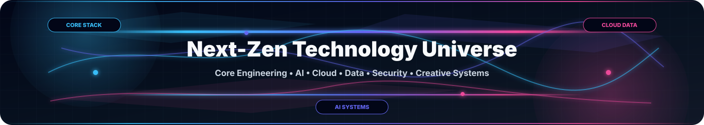
</p>

### ⚡ Core Engineering

<p align="center">
  
</p>

### 🌌 Frontend • Web Experience

<p align="center">
  
  <br><br>
  
  
  
  
  
</p>

### 🧠 AI • AGI • Autonomous Systems

<p align="center">
  
  <br><br>
  
  
  
  
  
  
  
  
  
  
  
  
  
  
  
  
  
  
  
</p>

### ☁️ Cloud Native • Platform Engineering

<p align="center">
  
  <br><br>
  
  
  
  
  
  
  
  
  
  
  
  
  
</p>

### 🗄️ Distributed Data Systems

<p align="center">
  
  <br><br>
  
  
  
  
  
  
  
  
  
  
</p>

### 🔐 Cybersecurity • Zero Trust

<p align="center">
  
  <br><br>
  
  
  
  
  
  
  
  
  
  
  
</p>

### 🌐 Web3 • Robotics • XR • Creative Engineering

<table align="center" width="100%">
<tr>
<th align="center" width="220">Web3</th>
<th align="center" width="220">Robotics / IoT</th>
<th align="center" width="220">Graphics / XR</th>
<th align="center" width="220">Creative</th>
</tr>
<tr>
<td align="center"></td>
<td align="center"></td>
<td align="center"></td>
<td align="center"></td>
</tr>
<tr>
<td align="center">Smart Contracts • Layer2 • DAO</td>
<td align="center">Embedded • Edge AI • Automation</td>
<td align="center">WebXR • Simulation • Spatial Computing</td>
<td align="center">Design Systems • UI Motion • Generative Design</td>
</tr>
</table>

### 🧰 Elite Developer Arsenal

<p align="center">
  
  <br><br>
  
  
  
  
  
  
</p>

<details>
<summary><b>🧪 Future Tech Research Radar</b></summary>

<br>

<p align="center">
  
  
  
  
  
  
</p>

</details>

---

<a id="future--dangerous-command-center"></a>

<p align="center">
  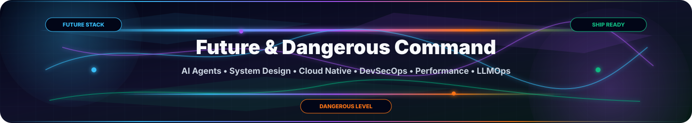
</p>

<p align="center">
  
  
  
</p>

### 🚀 Future Engineering Stack

<p align="center">
  
  
  
  
  
  
  
  
  
  
  
  
  
  
  
  
  
</p>

### ⚠️ Dangerous Skill Matrix

```text
SKILL AREA                  | WHAT I CAN BUILD / HANDLE                         | LEVEL
System Design at Scale      | Distributed systems, real-time flows, growth paths | Dangerous
Production Debugging        | Root cause analysis, hotfixes, rollout recovery    | Dangerous
Performance Engineering     | Latency, throughput, cache, query, and cost tuning | Dangerous
Security Hardening          | Auth, validation, secrets, Zero Trust defaults     | Advanced+
API Architecture            | REST, GraphQL, tRPC, versioning, typed contracts   | Advanced+
Database Optimization       | Indexing, query plans, schema, replication paths   | Advanced+
Distributed Observability   | Logs, metrics, traces, alerts, incident context    | Advanced+
Cloud Cost Optimization     | Resource sizing, caching, scaling, architecture    | Advanced+
CI/CD Automation            | Test gates, releases, previews, rollback paths     | Advanced+
Incident Response           | Triage, mitigation, postmortem, prevention loops   | Advanced+
AI Product Engineering      | Agents, RAG, copilots, ML workflows, evaluations   | Dangerous
Production Prompt Systems   | Tool calling, structured outputs, guardrails       | Advanced+
Data Pipeline Design        | ETL, analytics, streaming, ML-ready data layers    | Advanced+
Multi-tenant SaaS           | Tenant isolation, roles, billing-ready foundations | Advanced+
```

### 🤖 AI Agent Arsenal

```text
AGENT CORE       | Planning, memory, tool calling, structured outputs, task orchestration
RAG ENGINE       | Embeddings, vector search, reranking, source-grounded responses
MULTI-AGENT OPS  | Role-based agents, handoffs, workflows, review loops
EVAL LAYER       | Test prompts, regression checks, hallucination checks, quality scoring
AUTOMATION FLOW  | Browser/API/file/database actions connected into reliable pipelines
```

<p align="center">
  
  
  
  
  
  
  
</p>

### 🛰️ Production War Room

```text
SIGNAL     -> logs, traces, metrics, errors, user impact
TRIAGE     -> isolate blast radius, identify owner, reproduce issue
MITIGATE   -> rollback, feature flag, patch, scale, queue drain
RECOVER    -> verify, monitor, document, communicate
HARDEN     -> tests, alerts, guardrails, runbooks, architecture fix
```

### 🧨 System Design Weapons

```text
API CONTRACTS      | Typed payloads, explicit errors, version-aware boundaries
EVENT STREAMS      | Kafka, NATS, RabbitMQ, queues, retries, idempotent consumers
DISTRIBUTED DATA   | Postgres, Redis, MongoDB, DynamoDB, search, vector databases
REAL-TIME SYSTEMS  | WebSockets, pub/sub, live dashboards, notifications
MULTI-TENANCY      | Tenant isolation, RBAC, audit trails, billing-ready structure
WASM / EDGE        | Low-latency compute, edge functions, portable runtime surfaces
```

### ☁️ Cloud Native Command Center

<p align="center">
  
  
  
  
  
  
  
  
  
  
</p>

### 🔐 Security & DevSecOps Layer

```text
ZERO TRUST          | least privilege, identity-first access, safe defaults
APPSEC              | OWASP checks, validation, rate limits, secure sessions
SUPPLY CHAIN        | dependency checks, CI gates, signed releases, secret hygiene
CLOUD SECURITY      | IAM boundaries, WAF rules, audit logs, network controls
DATA PROTECTION     | encryption, privacy-aware flows, secure storage, backups
```

### ⚡ Performance Engineering Lab

```text
FRONTEND SPEED      | bundle size, hydration, rendering, image strategy, caching
BACKEND LATENCY     | profiling, async work, queueing, connection pooling
DATABASE TUNING     | indexes, query plans, denormalization, read/write patterns
REAL-TIME SCALE     | fanout control, backpressure, socket lifecycle, pub/sub design
CLOUD COST          | right-sized infrastructure, cache strategy, usage-aware scaling
```

### 🧪 LLMOps / MLOps Pipeline

```text
DATA -> EMBEDDINGS -> RETRIEVAL -> RERANKING -> PROMPT -> TOOL CALLS
     -> EVALUATION -> MONITORING -> FEEDBACK -> IMPROVEMENT -> RELEASE
```

<p align="center">
  
  
  
  
  
  
</p>

### 🧭 Next-Zen Roadmap

```text
NOW       | AI agents, real-time systems, cloud-native platforms, automation
NEXT      | multimodal products, edge AI, LLMOps, service mesh, stronger DevSecOps
FUTURE    | autonomous systems, digital twins, WebAssembly edges, AGI-era workflows
MISSION   | useful, scalable, secure products that survive real production pressure
```

---

<a id="system-design-playbook"></a>

<p align="center">
  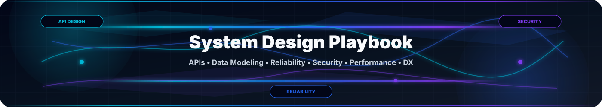
</p>

<table align="center" width="100%">
<tr><th align="center" width="240">Design Area</th><th align="center" width="640">Preferred Direction</th></tr>
<tr><td><b>API Design</b></td><td>Clear contracts, typed payloads, explicit errors, versioning when needed</td></tr>
<tr><td><b>Data Modeling</b></td><td>Start simple, index intentionally, design for query patterns and growth</td></tr>
<tr><td><b>Event Systems</b></td><td>Queues, streams, retries, idempotency, backpressure, fanout control</td></tr>
<tr><td><b>Reliability</b></td><td>Timeouts, retries, rollback paths, runbooks, observability hooks</td></tr>
<tr><td><b>Security</b></td><td>Least privilege, validation, secret isolation, audit-friendly flows</td></tr>
<tr><td><b>Performance</b></td><td>Cache only where it helps, profile first, optimize for latency and cost</td></tr>
<tr><td><b>Edge / WASM</b></td><td>Low-latency compute, portable runtime surfaces, serverless boundaries</td></tr>
<tr><td><b>DX</b></td><td>Scripts, documentation, local setup, and maintainable conventions</td></tr>
</table>

---

<a id="delivery-blueprint"></a>

<p align="center">
  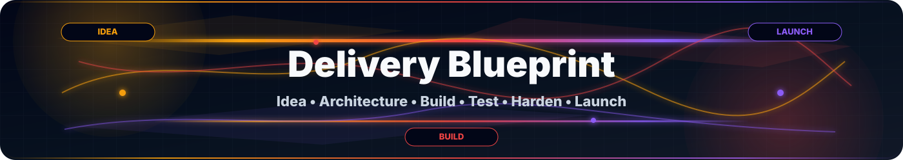
</p>

```text
Idea → Requirements → Architecture → Prototype → Production Build
     → Testing → Observability → Hardening → Launch → Feedback → Iteration
```

<table align="center" width="100%">
<tr><th align="center" width="240">Phase</th><th align="center" width="640">Output</th></tr>
<tr><td><b>Discovery</b></td><td>Feature map, risk map, user flows, success metrics</td></tr>
<tr><td><b>Implementation</b></td><td>Clean code, reusable modules, API boundaries, security defaults</td></tr>
<tr><td><b>Verification</b></td><td>Tests, evals, manual QA notes, edge-case checks</td></tr>
<tr><td><b>Observability</b></td><td>Logs, metrics, traces, alerts, debugging context</td></tr>
<tr><td><b>Release</b></td><td>Deployment readiness, rollback thinking, docs, feedback loops</td></tr>
</table>

---

<a id="project-launchpad"></a>

<p align="center">
  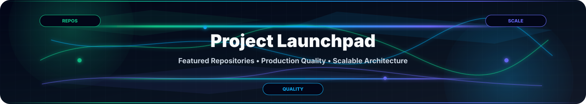
</p>

<p align="center">
  
  
</p>

<table align="center" width="100%">
<tr><th align="center" width="300">Project Quality Signal</th><th align="center" width="580">Meaning</th></tr>
<tr><td><b>✅ Production-quality code</b></td><td>Designed to survive real usage</td></tr>
<tr><td><b>🔒 Security practices</b></td><td>Auth, validation, privacy, and safe defaults</td></tr>
<tr><td><b>📈 Scalable architecture</b></td><td>Clear boundaries and growth paths</td></tr>
<tr><td><b>📚 Documentation</b></td><td>Systems that can be understood and improved</td></tr>
<tr><td><b>🚀 Performance optimization</b></td><td>Fast enough, measurable, and cost-aware</td></tr>
<tr><td><b>🤖 AI readiness</b></td><td>Agent workflows, RAG grounding, evals, monitoring, feedback loops</td></tr>
<tr><td><b>🛰️ Observability</b></td><td>Logs, metrics, traces, incidents, and production signals</td></tr>
</table>

---

<a id="github-analytics--insights"></a>

<p align="center">
  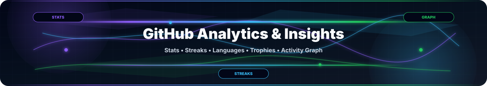
</p>

<p align="center">
  
  
  
</p>

<p align="center">
  
  
  
  
  
</p>

### 📊 GitHub Command Dashboard

<p align="center">
  
</p>

### 📡 Stats Mirror

<p align="center">
  
  
  <br><br>
  
  <br><br>
  <a href="https://visitcount.itsvg.in"></a>
</p>

### 🧠 Engineering Signal Cards

<p align="center">
  
</p>

### 🏆 Achievement Layer

<p align="center">
  
</p>

### 📊 Contribution Pulse

<p align="center">
  
</p>

### 🐍 Contribution Flow

<p align="center">
  
</p>

```text
ANALYTICS FOCUS  -> commits, languages, streaks, contribution flow, project momentum
ENGINEERING MAP  -> full-stack systems, AI agents, LLMOps, DevSecOps, cloud-native delivery
SIGNAL QUALITY   -> consistency, depth, production mindset, and long-term iteration
LEARNING LOOP    -> build, measure, harden, document, improve, repeat
```

<p align="center">
  
  
  
</p>

---

<a id="global-signal"></a>

<p align="center">
  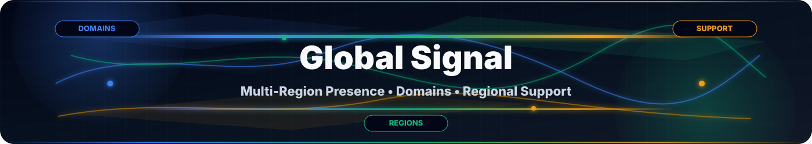
</p>

<p align="center">
  <a href="mailto:Support@moparapairayat.com"></a>
  <a href="https://moparapairayat.com"></a>
  <a href="https://moparapairayat.uk"> </a>
  <a href="https://moparapairayat.bd"> </a>
  <a href="https://moparapairayat.sa"> </a>
  <a href="https://moparapairayat.tr"> </a>
  <a href="https://moparapairayat.ir"> </a>
  <a href="https://moparapairayat.us"> </a>
  <a href="https://moparapairayat.ca"> </a>
  <a href="https://moparapairayat.de"> </a>
</p>

### 📍 Regional Contact Matrix

<p align="center">
  
  
  
</p>

<table align="center" width="100%">
<tr>
<td width="285" align="center" valign="top">
  
  <br><br>
  <b>🌍 Global HQ</b>
  <br>
  <a href="https://moparapairayat.com"><b>moparapairayat.com</b></a>
  <br>
  <a href="mailto:Support@moparapairayat.com">Support@moparapairayat.com</a>
  <br><br>
  <sub>International clients and global services</sub>
</td>
<td width="285" align="center" valign="top">
  
  <br><br>
  
  <b>Turkey</b>
  <br>
  <a href="https://moparapairayat.tr"><b>moparapairayat.tr</b></a>
  <br>
  <a href="mailto:Support@moparapairayat.tr">Support@moparapairayat.tr</a>
  <br><br>
  <sub>Turkish and EU services</sub>
</td>
<td width="285" align="center" valign="top">
  
  <br><br>
  
  <b>Bangladesh</b>
  <br>
  <a href="https://moparapairayat.bd"><b>moparapairayat.bd</b></a>
  <br>
  <a href="mailto:Support@moparapairayat.bd">Support@moparapairayat.bd</a>
  <br><br>
  <sub>Regional operations hub</sub>
</td>
</tr>
<tr>
<td width="285" align="center" valign="top">
  
  <br><br>
  
  <b>Saudi Arabia</b>
  <br>
  <a href="https://moparapairayat.sa"><b>moparapairayat.sa</b></a>
  <br>
  <a href="mailto:Support@moparapairayat.sa">Support@moparapairayat.sa</a>
  <br><br>
  <sub>Middle East operations</sub>
</td>
<td width="285" align="center" valign="top">
  
  <br><br>
  
  <b>United Kingdom</b>
  <br>
  <a href="https://moparapairayat.uk"><b>moparapairayat.uk</b></a>
  <br>
  <a href="mailto:Support@moparapairayat.uk">Support@moparapairayat.uk</a>
  <br><br>
  <sub>UK-based services and support</sub>
</td>
<td width="285" align="center" valign="top">
  
  <br><br>
  
  <b>Iran</b>
  <br>
  <a href="https://moparapairayat.ir"><b>moparapairayat.ir</b></a>
  <br>
  <a href="mailto:Support@moparapairayat.ir">Support@moparapairayat.ir</a>
  <br><br>
  <sub>Iran-based services and support</sub>
</td>
</tr>
<tr>
<td width="285" align="center" valign="top">
  
  <br><br>
  
  <b>USA</b>
  <br>
  <a href="https://moparapairayat.us"><b>moparapairayat.us</b></a>
  <br>
  <a href="mailto:Support@moparapairayat.us">Support@moparapairayat.us</a>
  <br><br>
  <sub>USA-based services and support</sub>
</td>
<td width="285" align="center" valign="top">
  
  <br><br>
  
  <b>Canada</b>
  <br>
  <a href="https://moparapairayat.ca"><b>moparapairayat.ca</b></a>
  <br>
  <a href="mailto:Support@moparapairayat.ca">Support@moparapairayat.ca</a>
  <br><br>
  <sub>Canada-based services and support</sub>
</td>
<td width="285" align="center" valign="top">
  
  <br><br>
  
  <b>Germany</b>
  <br>
  <a href="https://moparapairayat.de"><b>moparapairayat.de</b></a>
  <br>
  <a href="mailto:Support@moparapairayat.de">Support@moparapairayat.de</a>
  <br><br>
  <sub>Germany-based services and support</sub>
</td>
</tr>
</table>

---

<a id="contact--connect"></a>

<p align="center">
  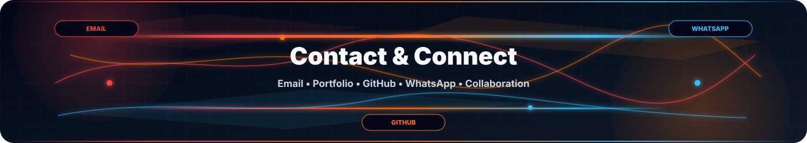
</p>

<p align="center">
  
  
  
</p>

<p align="center">
  <b>Ready to collaborate? Choose your preferred channel below.</b>
</p>

### 💼 Communication Channels

<table align="center" width="100%">
<tr>
<td width="285" align="center" valign="top">
  
  <br><br>
  <b>General inquiries and contracts</b>
  <br><br>
  <a href="mailto:Support@moparapairayat.com">Send Email</a>
</td>
<td width="285" align="center" valign="top">
  
  <br><br>
  <b>View full work and services</b>
  <br><br>
  <a href="https://moparapairayat.com">Visit Site</a>
</td>
<td width="285" align="center" valign="top">
  
  <br><br>
  <b>Projects and open source</b>
  <br><br>
  <a href="https://github.com/Moparapairayat">Follow</a>
</td>
</tr>
</table>

### 💌 Business Email Contacts

<table align="center" width="100%">
<tr>
<td width="440" align="center" valign="top">
  
  <br><br>
  <a href="mailto:Moparapairayat@gmail.com"><b>📧 Moparapairayat@gmail.com</b></a>
</td>
<td width="440" align="center" valign="top">
  
  <br><br>
  <a href="mailto:Moparapairayatbd@gmail.com"><b>📧 Moparapairayatbd@gmail.com</b></a>
</td>
</tr>
</table>

### 📞 WhatsApp Business Lines

<p align="center">
  
  
</p>

<table align="center" width="100%">
<tr>
<td colspan="4" align="center" valign="top">
  <b>Direct Lines by Workstream</b>
  <br>
  <sub>Choose the lane that matches your project type for faster routing.</sub>
</td>
</tr>
<tr>
<th align="center" width="230">Lane</th>
<th align="center" width="190">Number</th>
<th align="center" width="290">Best For</th>
<th align="center" width="170">Action</th>
</tr>
<tr>
<td align="center" valign="middle">
  
</td>
<td align="center" valign="middle">
  <a href="https://wa.me/17243155810"><b>📱 724-315-5810</b></a>
</td>
<td align="center" valign="middle">
  <sub>Startup and personal projects</sub>
</td>
<td align="center" valign="middle">
  <a href="https://wa.me/17243155810">
    
  </a>
</td>
</tr>
<tr>
<td align="center" valign="middle">
  
</td>
<td align="center" valign="middle">
  <a href="https://wa.me/17196802913"><b>📱 719-680-2913</b></a>
</td>
<td align="center" valign="middle">
  <sub>Enterprise and corporate work</sub>
</td>
<td align="center" valign="middle">
  <a href="https://wa.me/17196802913">
    
  </a>
</td>
</tr>
<tr>
<td align="center" valign="middle">
  
</td>
<td align="center" valign="middle">
  <a href="https://wa.me/8801955000704"><b>📱 801955000704</b></a>
</td>
<td align="center" valign="middle">
  <sub>Data science and ML</sub>
</td>
<td align="center" valign="middle">
  <a href="https://wa.me/8801955000704">
    
  </a>
</td>
</tr>
<tr>
<td align="center" valign="middle">
  
</td>
<td align="center" valign="middle">
  <a href="https://wa.me/8801305868621"><b>📱 801305868621</b></a>
</td>
<td align="center" valign="middle">
  <sub>Security and cloud</sub>
</td>
<td align="center" valign="middle">
  <a href="https://wa.me/8801305868621">
    
  </a>
</td>
</tr>
</table>

### 🎯 Response Time Expectations

<p align="center">
  
  
  
</p>

### ✨ Let's Collaborate!

<table align="center" width="100%">
<tr>
<td width="176" align="center" valign="top">
  <b>💡 Project Ideas</b>
  <br>
  <sub>Product concepts</sub>
</td>
<td width="176" align="center" valign="top">
  <b>🏢 Enterprise Needs</b>
  <br>
  <sub>Large-scale systems</sub>
</td>
<td width="176" align="center" valign="top">
  <b>🚀 Startup Challenges</b>
  <br>
  <sub>Fast MVP execution</sub>
</td>
<td width="176" align="center" valign="top">
  <b>📚 Learning</b>
  <br>
  <sub>Mentorship and growth</sub>
</td>
<td width="176" align="center" valign="top">
  <b>🤝 Partnership</b>
  <br>
  <sub>Long-term collaboration</sub>
</td>
</tr>
<tr>
<td width="176" align="center" valign="top">
  <b>🤖 AI Agents</b>
  <br>
  <sub>Automation systems</sub>
</td>
<td width="176" align="center" valign="top">
  <b>🛡️ DevSecOps</b>
  <br>
  <sub>Secure platforms</sub>
</td>
<td width="176" align="center" valign="top">
  <b>⚡ Scale Lab</b>
  <br>
  <sub>Performance work</sub>
</td>
<td width="176" align="center" valign="top">
  <b>🧪 LLMOps</b>
  <br>
  <sub>Evaluation loops</sub>
</td>
<td width="176" align="center" valign="top">
  <b>☁️ Cloud Native</b>
  <br>
  <sub>Platform systems</sub>
</td>
</tr>
</table>

---

<a id="support-the-work"></a>

<p align="center">
  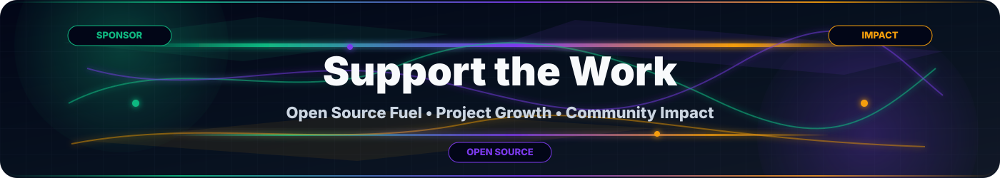
</p>

<p align="center">
  
  
  
</p>

<p align="center">
  If my work has been helpful to you, consider supporting my projects and future development.
</p>

<table align="center" width="100%">
<tr>
<td colspan="3" align="center" valign="top">
  <b>Support Channels</b>
  <br>
  <sub>Pick a lane, fuel the roadmap, and help future tools ship faster.</sub>
</td>
</tr>
<tr>
<th align="center" width="300">Channel</th>
<th align="center" width="300">Purpose</th>
<th align="center" width="280">Status / Action</th>
</tr>
<tr>
<td align="center" valign="middle">
  <a href="https://buymeacoffee.com/moparapairayat">
    
  </a>
</td>
<td align="center" valign="middle">
  <b>Support my work</b>
</td>
<td align="center" valign="middle">
  <a href="https://buymeacoffee.com/moparapairayat">
    
  </a>
</td>
</tr>
<tr>
<td align="center" valign="middle">
  <a href="https://ko-fi.com/moparapairayat">
    
  </a>
</td>
<td align="center" valign="middle">
  <b>Support innovation</b>
</td>
<td align="center" valign="middle">
  <a href="https://ko-fi.com/moparapairayat">
    
  </a>
</td>
</tr>
<tr>
<td align="center" valign="middle">
  <a href="https://github.com/sponsors/Moparapairayat">
    
  </a>
</td>
<td align="center" valign="middle">
  <b>Become a sponsor</b>
</td>
<td align="center" valign="middle">
  <a href="https://github.com/sponsors/Moparapairayat">
    
  </a>
</td>
</tr>
</table>

<p align="center">
  <b>Your support helps me:</b>
</p>

<table align="center" width="100%">
<tr>
<td width="220" align="center" valign="top">
  
  <br><br>
  <b>Continue building open-source projects</b>
</td>
<td width="220" align="center" valign="top">
  
  <br><br>
  <b>Create better tools and solutions</b>
</td>
<td width="220" align="center" valign="top">
  
  <br><br>
  <b>Share knowledge through tutorials</b>
</td>
<td width="220" align="center" valign="top">
  
  <br><br>
  <b>Make positive global impact</b>
</td>
</tr>
</table>

---

<a id="philosophy--core-values"></a>

<p align="center">
  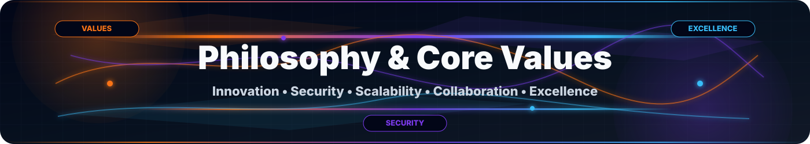
</p>

```text
INNOVATION    → Building next-gen solutions
SECURITY      → Trust through protection
SCALABILITY   → Growing without limits
COLLABORATION → Stronger together
EXCELLENCE    → Never settle for less
```

> *"Code is poetry. Architecture is art. Innovation is impact."*
>
> **— Mopara Pair Ayat**

---

<a id="quick-stats"></a>

<p align="center">
  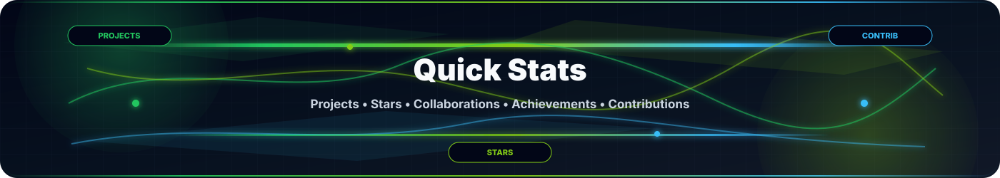
</p>

<table align="center" width="100%">
<tr><th align="center" width="440">Metric</th><th align="center" width="440">Count</th></tr>
<tr><td><b>💻 Projects</b></td><td align="center"><b>2050+</b></td></tr>
<tr><td><b>⭐ GitHub Stars</b></td><td align="center"><b>5000+</b></td></tr>
<tr><td><b>🤝 Collaborations</b></td><td align="center"><b>300+</b></td></tr>
<tr><td><b>🏆 Achievements</b></td><td align="center"><b>200+</b></td></tr>
<tr><td><b>📚 Contributions</b></td><td align="center"><b>7000+</b></td></tr>
</table>

---

<a id="ready-to-collaborate"></a>

<p align="center">
  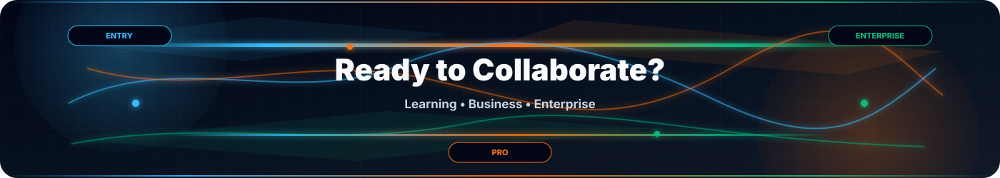
</p>

<table align="center" width="100%">
<tr><th align="center" width="220">Level</th><th align="center" width="420">Perfect For</th><th align="center" width="240">Get Started</th></tr>
<tr><td><b>🎓 Entry</b></td><td>Learning and growth</td><td align="center"><a href="mailto:Support@moparapairayat.com">Email</a></td></tr>
<tr><td><b>💼 Professional</b></td><td>Business needs</td><td align="center"><a href="https://github.com/Moparapairayat">GitHub</a></td></tr>
<tr><td><b>🚀 Enterprise</b></td><td>Large-scale projects</td><td align="center"><a href="https://moparapairayat.com">Portfolio</a></td></tr>
</table>

<p align="center">
  
</p>

<p align="center">
  
</p>

<a id="final-call-to-action"></a>

<p align="center">
  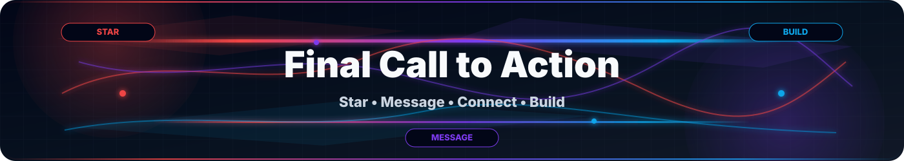
</p>

```text
┌─────────────────────────────────────────┐
│  Star my repositories for support       │
│  Drop a message on any platform         │
│  Connect with me on GitHub              │
│  Email for project inquiries            │
│  Let's create something extraordinary   │
└─────────────────────────────────────────┘
```

<h3 align="center">🎖️ Made with ❤️ by Mopara Pair Ayat</h3>

<p align="center">
  <i>Crafting digital excellence, one commit at a time.</i>
  <br><br>
  <a href="#mopara-pair-ayat"></a>
</p>
